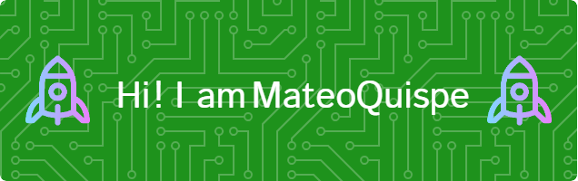

  
<!--  -->

 

## <picture></picture> About me

<picture> </picture>

  
- 🎓I’m currently learning Computer Engineering at  [Faculty of Exact, Physical and Natural Sciences](https://fcefyn.unc.edu.ar) at [National University of Cordoba](https://www.unc.edu.ar).
-  🧠Interested in embedded systems, artificial intelligence and building projects that integrate hardware and software.
-  🚀I’m currently open for a new job opportunity, this is [MY RESUME](https://drive.google.com/file/d/11l1aj3zFS11Bpvv_kLjlmndxULTFII_2/view?usp=sharing).
-  Always eager to learn, build, and take on new challenges
  
## 

  
  
  
  

## 🛠️ My Skills/
### Programming languages

 
  
   
  
  
  

### <picture>   </picture> Software & Tools

  
  
  
  
  

  
  
  

 ### <picture>   </picture> IDEs
 

  &emsp;
    
  &emsp;
    

